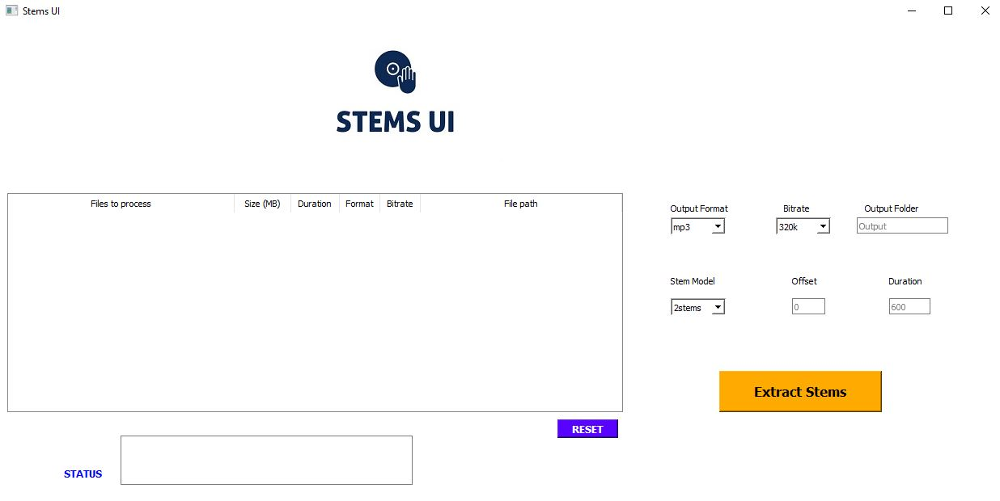

# StemsUI
Provides an interface for the Spleeter API by Deezer

This script assumes an already working installation of your spleeter library. To use the script ensure you first install the `pyqt5` and `audio_metadata` libraries by running:

`pip install pyqt5 audio_metadata`

Once the libraries are installed, double click the StemsUI.pyw file in the engine folder to open and use the interface. 

Screenshot:

## Instructions

1. Drag any audio files into the files window. You can drag multiple files at once. 
2. Select the required settings and click Extract Stems to separate files. Default settings shown highlighted in grey are used if you don't specify anything.
3. The separation process is memory intensive so if your computer specs are low the separation might not work, or if for example you are using the 2stems model you might sometimes notice only one file gets created instead of 2. To isolate issues to your computer specs if you aren't getting any other errors, use a lower duration setting for the output eg 10sec to see if you get any output.
4. When the process is complete, Status window shows "Done". 

    Have fun!!
